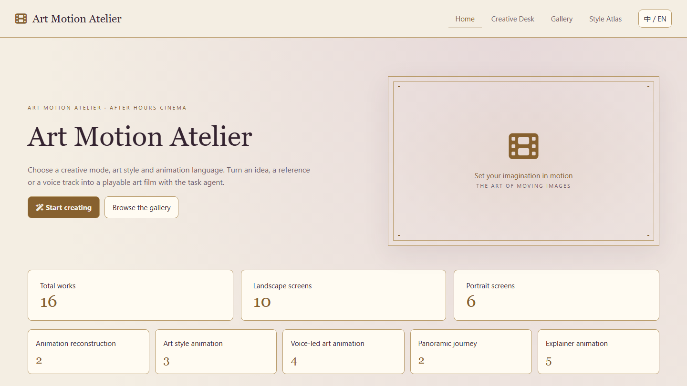
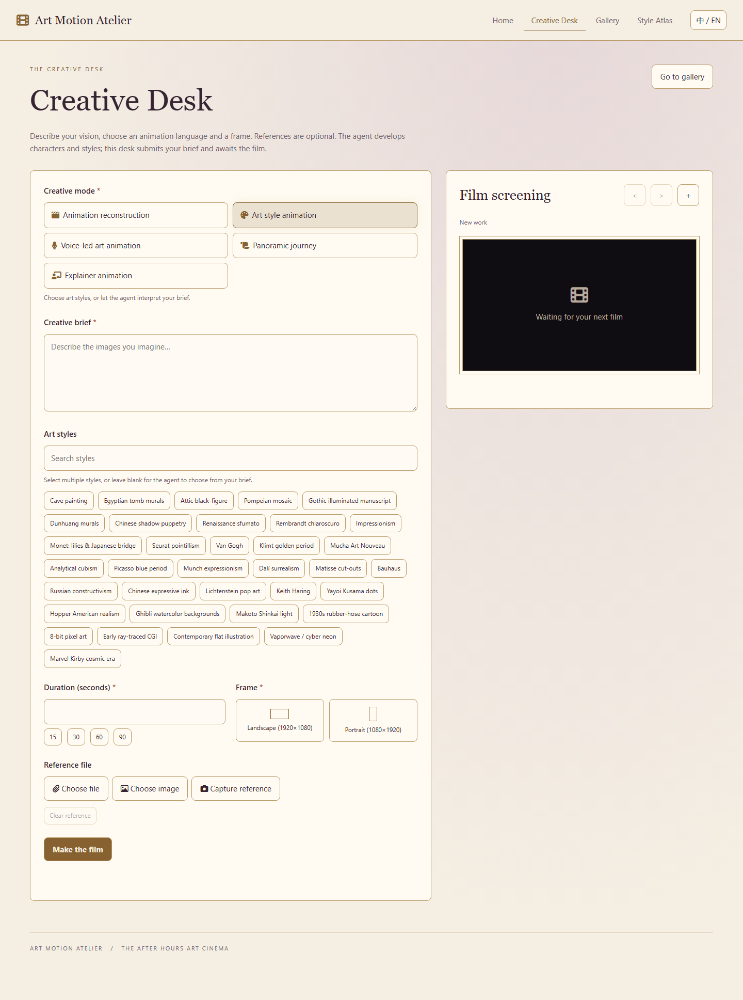
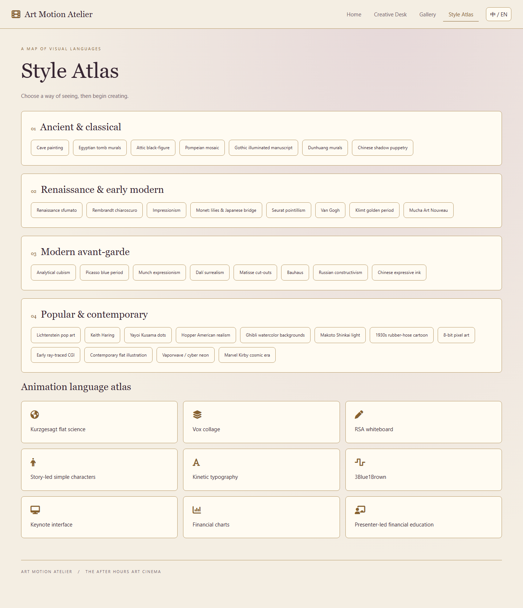

<p align="center">
  <a href="README.md"></a>
  <a href="README.en.md"></a>
</p>

# Art Animation Workshop

**Turn an art animation Skill into an app, and creative briefs into playable short films.**

Art Animation Workshop is a standalone art animation app that gives [Huashu's huashu-art-motion Skill](https://github.com/alchaincyf/huashu-art-motion) a browser interface. Choose a creative mode, art styles, animation language, duration, and frame format. Add a brief and reference materials, then let an AI agent produce an animation you can view, play, and download in the app.

Start the app independently from its own directory to open the workshop directly. It uses runtime: **AirThink** serves app pages, files, and data, while **AirCode** runs AI tasks through your local **Codex CLI**, using your existing Codex sign-in environment.



## What You Can Make

| Creative Mode | Use Cases |
| --- | --- |
| Animation reconstruction | Upload a reference animation, analyze its movement, rhythm, and transitions, and recreate its mechanisms |
| Art style animation | Create animations inspired by Van Gogh, Monet, Bauhaus, ink painting, pixel art, and other styles |
| Voice-led art animation | Create visuals from narration and timing cues, with a silent visual track as a possible deliverable |
| Panoramic journey | Have a character travel through different art worlds, changing styles at scene boundaries |
| Explainer animation | Present ideas through whiteboard drawings, collage, kinetic type, charts, and other animation languages |

- **35 art styles**: Browse the style atlas. Art style animations and panoramic journeys support multiple styles; when none are selected, the agent chooses from your brief.
- **9 animation languages**: Kurzgesagt flat explainers, Vox collage, whiteboard, storytime characters, kinetic type, 3Blue1Brown, keynote UI, finance charts, and presenter-led finance explainers.
- **Landscape and portrait**: Choose `1920×1080` landscape or `1080×1920` portrait and enter a target duration.
- **Reference input**: Select files or images, or capture a photo. Reconstruction requires a reference file.
- **Work management**: Search, filter, play, download, edit, and remix works in the gallery.
- **Chinese and English UI**: Switch languages inside the app.

The task targets a single playable **MP4 animation file** as its deliverable. Results and production time depend on task complexity, materials, model capabilities, and your local environment.

## App Screenshots

**Creative Desk**: Enter a brief, choose a mode and art styles, set the duration and frame format, and upload references before submitting your task.



**Style Atlas**: Browse 35 art styles and 9 animation languages. Click an art style to start a new brief in the Creative Desk.



## How It Works

```text
Art Animation Workshop in your browser
      │
      ▼
AirThink (3130)
App pages, creative records, and reference files
      │
      ▼
AirCode (3131)
Task and workflow execution
      │
      ▼
Local Codex CLI + huashu-art-motion Skill
      │
      ▼
Produces animation and returns results to the app
```

AirCode runs AI tasks through `codex exec`. AirThink also uses port `3133` for WebSocket communication. Before starting, make sure the Windows user running the services can successfully execute Codex tasks from the command line.

## Quick Start

### 1. Set Up Your Environment

The current startup scripts target **Windows**. You will need:

- Python 3, with working `python` and `pip` commands.
- Codex CLI installed, signed in, and able to run tasks, with `codex` on your `PATH`.
- A modern browser and a network connection for installing dependencies and accessing AI services.
- `uv`, FFmpeg, and Playwright Chromium for the animation Skill. Some character tasks also need image generation capabilities and suitable assets.

Check your environment in PowerShell and install `waitress`, which is required to start the services:

```powershell
python --version
python -m pip --version
codex --version
python -m pip install waitress
uv --version
ffmpeg -version
uv run --with playwright playwright install chromium
```

Both services check for missing Python dependencies at startup and install them through pip. Prepare the animation tools separately; see the [upstream Skill documentation](https://github.com/alchaincyf/huashu-art-motion) for dependencies and asset requirements. The project already includes the Skill files, so a separate Skill installation command is unnecessary to start the app.

### 2. Start the App

From the parent directory containing this project, enter the app directory and run:

```powershell
cd "Art Animation Workshop"
.\start.bat
```

You can also open the `Art Animation Workshop` folder in File Explorer and double-click `start.bat`.

The script starts AirThink and AirCode. Once it detects a service listening on port `3130`, it automatically opens the app:

**[http://127.0.0.1:3130/index.html](http://127.0.0.1:3130/index.html)**

Keep both service windows open while using the app. AirCode may still be installing dependencies when the page opens; wait for it to finish starting before running tasks. Close both service windows when you are done to stop the services.

> The startup script first forcibly terminates processes using ports `3130` and `3131`. openair and this app use the same ports, so run them separately. If openair is running, close its service windows first.

### 3. Make Your First Animation

1. Open the studio and enter a creative brief describing subjects, scenes, actions, rhythm, and transitions. For narration tasks, include the script and timing cues.
2. Choose a creative mode and select art styles or an animation language as appropriate.
3. Enter a target duration greater than `0`, choose landscape or portrait, and upload references as needed.
4. Click "Make the film" and wait for the background task to finish.
5. Play the film in the preview or gallery, then click "Download film" to save the MP4. You can also view details, edit the record, or remix the work.

Start with a short task, for example:

> Create a 10-second Van Gogh-inspired animation: stars swirl in the night sky, a wheat field sways in the foreground, the camera slowly moves forward, and the scene fades out at the end. Landscape, no narration.

Choose "Art style animation," the "Van Gogh" style, a duration of `10` seconds, and landscape format, then submit the task.

## Project Structure

```text
Art Animation Workshop/
├── README.md             # Chinese documentation
├── README.en.md          # English documentation
├── docs/images/          # Chinese and English screenshots and language badges
├── start.bat             # Starts both services and opens the app
├── AirCode/
│   ├── app.py            # Task service entry point
│   ├── startweb.py       # HTTP server startup entry point (3131)
│   ├── run.bat
│   ├── worker/           # Workflows, AI calls, and task execution
│   ├── utilities/        # File handling and communication utilities
│   └── SERVERFILES/      # Task files and Codex working directory
└── AirThink/
    ├── app.py            # App, file, data, and communication services
    ├── startweb.py       # HTTP server startup entry point (3130)
    ├── run.bat
    ├── apps/             # Workshop pages, configuration, and creative records
    ├── files/            # App resources and uploaded files
    └── skills/           # huashu-art-motion Skill and resources
```

## FAQ

**The browser did not open automatically, or the page is inaccessible.**

Check the output in the AirThink window to confirm that dependency installation has finished and the service has started successfully. Then open the [app page](http://127.0.0.1:3130/index.html) manually. When starting from the command line, first navigate to the `Art Animation Workshop` directory because the startup script uses relative paths.

**The page opens, but no animation is produced.**

Check the AirCode window to confirm that the service has started. Verify that the same Windows user can successfully run Codex tasks in a terminal. Being able to run `codex --version` alone does not mean you are signed in or have available usage. Also check `uv`, FFmpeg, Playwright Chromium, and any required assets or image generation capabilities.

**Why does a narration animation have no sound?**

Voice-led art animation can deliver a silent MP4 visual track aligned to a narration timeline. Include timing cues and sound requirements in your brief and provide the relevant materials. Whether the final file includes sound depends on the task and available tools.

## Running the Services

The services currently listen on `0.0.0.0`. AirCode runs Codex tasks with `danger-full-access` and disables per-action approvals. Run the services in a trusted personal environment and do not expose them directly to the public internet.

## Skill Source and Credits

This app uses **[alchaincyf/huashu-art-motion](https://github.com/alchaincyf/huashu-art-motion)**, created by Huashu. Thanks to the upstream project for its art-style recipes, animation languages, rendering code, and production methods.

The upstream code and documentation use the MIT license. Fonts, derived stroke data, and demo character assets have separate licenses or usage restrictions; see the [license section in the Skill README](https://github.com/alchaincyf/huashu-art-motion#许可证). These terms apply to the upstream Skill and its resources.

## Contributing

Bug reports, suggestions, and code contributions are welcome. Include the creative mode, reproduction steps, service error messages, and your Python and Codex CLI versions. Remove keys and personal data before sharing logs.
