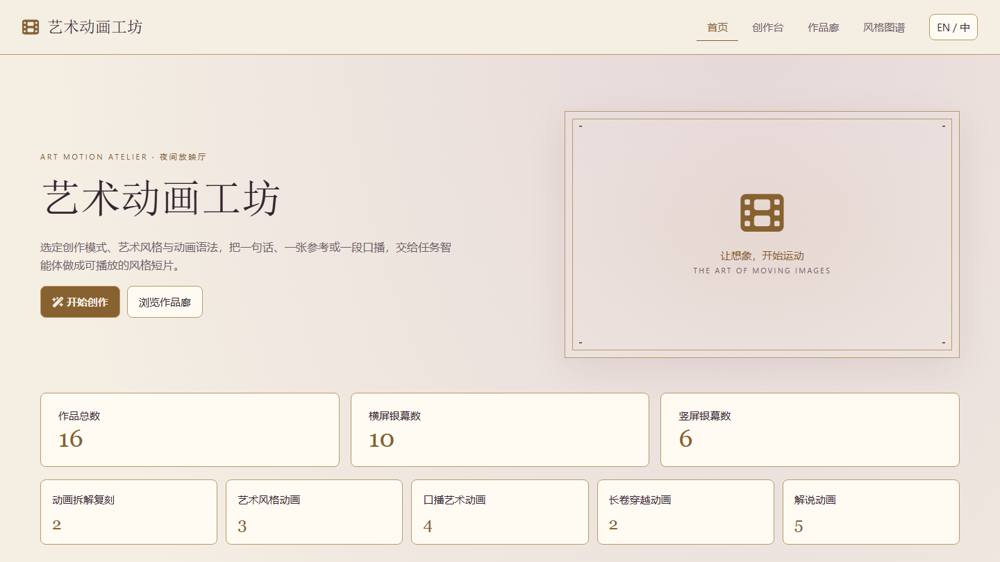
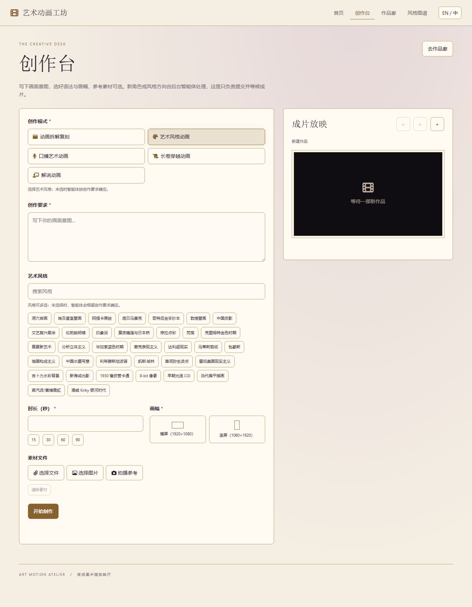
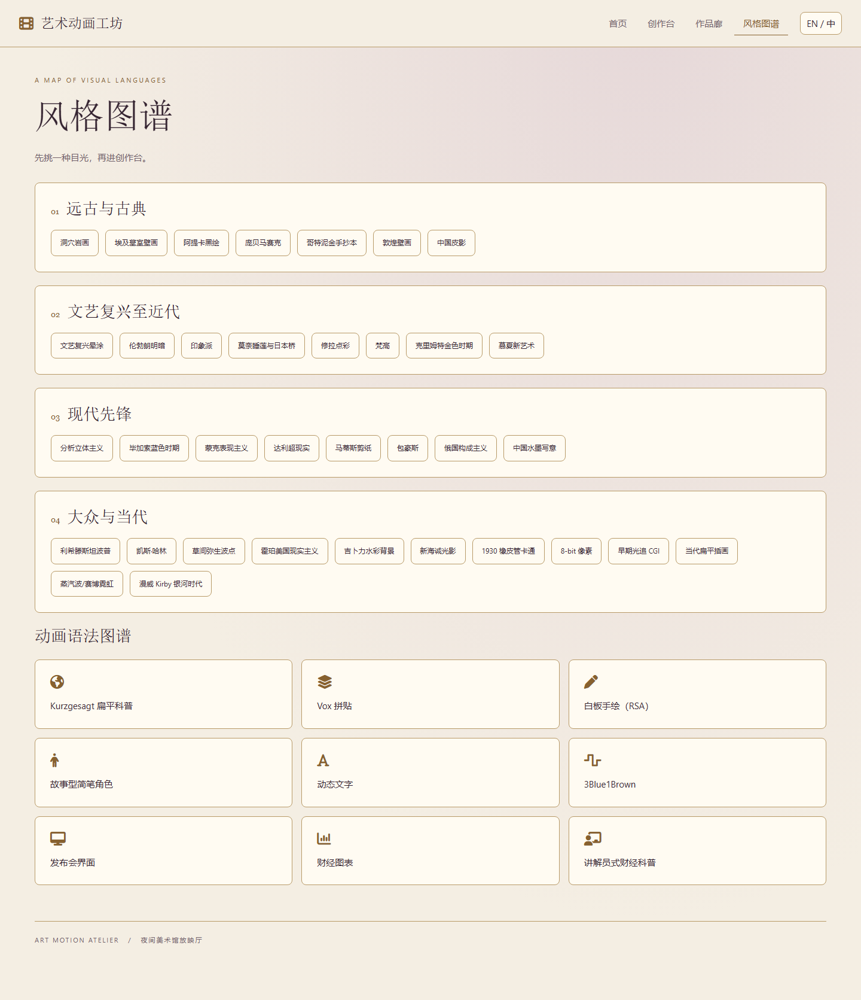

<p align="center">
  <a href="README.md"></a>
  <a href="README.en.md"></a>
</p>

# Art Animation Workshop · 艺术动画工坊

**把艺术动画 Skill 做成应用，让创作要求变成可播放的短片。**

Art Animation Workshop 是一个独立的艺术动画应用，将 [花叔的 huashu-art-motion Skill](https://github.com/alchaincyf/huashu-art-motion) 做成浏览器中的创作界面。选择创作模式、艺术风格、动画语法、时长和画幅，结合文字要求与参考素材，由 AI 智能体制作动画，并在应用中查看、播放和下载作品。

本应用可以从自己的目录独立启动，直接打开艺术动画工坊。它的运行机制：**AirThink** 提供应用页面、文件与数据服务，**AirCode** 通过本机 **Codex CLI** 执行 AI 任务，使用用户自己的 Codex 登录环境。



## 可以做什么

| 创作模式 | 使用方向 |
| --- | --- |
| 动画拆解复刻 | 上传参考动画，分析运动、节奏和转场，再按机制制作 |
| 艺术风格动画 | 根据创作要求制作梵高、莫奈、包豪斯、水墨、像素等风格动画 |
| 口播艺术动画 | 根据口播内容和时间提示制作对应画面，可交付无声画面轨 |
| 长卷穿越动画 | 让角色穿过不同艺术世界，在场景边界切换画风 |
| 解说动画 | 用白板、拼贴、动态文字、图表等动画语言呈现内容 |

- **35 种艺术风格**：在风格图谱中浏览，艺术风格动画和长卷穿越动画可多选风格；未选择时，智能体根据创作要求确定。
- **9 种动画语法**：包括 Kurzgesagt 扁平科普、Vox 拼贴、白板手绘、故事型简笔角色、动态文字、3Blue1Brown、发布会界面、财经图表和讲解员式财经科普。
- **横竖屏创作**：支持横屏 `1920×1080`、竖屏 `1080×1920`，可填写目标时长。
- **参考素材输入**：支持选择文件、图片或拍摄参考；拆解复刻模式必须上传参考素材。
- **作品管理**：在作品廊中搜索、筛选、播放、下载、编辑和再创作。
- **中英文界面**：应用内可切换中文和英文。

应用任务以一个可播放的 **MP4 动画文件**为目标交付。实际结果和制作时间取决于任务复杂度、素材、模型能力及本机环境。

## 应用截图

**创作台**：填写创作要求、选择模式和艺术风格，设置时长与画幅，上传参考素材后提交制作。



**风格图谱**：浏览 35 种艺术风格和 9 种动画语法，点击风格即可进入创作台。



## 工作原理

```text
浏览器中的艺术动画工坊
      │
      ▼
AirThink（3130）
应用页面、创作记录和素材文件
      │
      ▼
AirCode（3131）
任务与工作流执行
      │
      ▼
本机 Codex CLI + huashu-art-motion Skill
      │
      ▼
制作动画，结果返回应用
```

AirCode 通过 `codex exec` 执行 AI 任务，AirThink 还使用 `3133` 端口提供 WebSocket 通信。运行前，需要让启动服务的 Windows 用户能够在命令行中正常执行 Codex 任务。

## 快速开始

### 1. 准备环境

当前启动脚本面向 **Windows**。请准备：

- Python 3，且 `python`、`pip` 可以正常使用。
- 已安装、登录并可正常执行任务的 Codex CLI，且 `codex` 已加入 `PATH`。
- 现代浏览器，以及安装依赖和访问 AI 服务所需的网络连接。
- 动画 Skill 所需的 `uv`、FFmpeg 和 Playwright Chromium；部分角色制作任务还需要可用的生图能力和相应素材。

在 PowerShell 中检查环境并安装服务启动需要的 `waitress`：

```powershell
python --version
python -m pip --version
codex --version
python -m pip install waitress
uv --version
ffmpeg -version
uv run --with playwright playwright install chromium
```

两个服务会在启动时检查并通过 pip 安装缺失的 Python 依赖。动画工具需另行准备；具体依赖与素材要求见 [上游技能文档](https://github.com/alchaincyf/huashu-art-motion)。项目已包含 Skill 文件，无需为启动应用另行执行技能安装命令。

### 2. 启动应用

从本项目所在的父目录进入应用目录后运行：

```powershell
cd "Art Animation Workshop"
.\start.bat
```

也可以在资源管理器中打开 `Art Animation Workshop` 文件夹，双击 `start.bat`。

脚本会启动 AirThink 和 AirCode，在检测到 `3130` 端口开始监听后，自动打开应用：

**[http://127.0.0.1:3130/index.html](http://127.0.0.1:3130/index.html)**

使用期间请保留两个服务窗口。页面打开时，AirCode 可能仍在安装依赖，请等它完成启动后再执行任务。结束使用时，关闭两个服务窗口即可停止服务。

> 启动脚本会先强制结束占用 `3130`、`3131` 端口的进程。openair 与本应用使用相同端口，请勿同时启动；如正在使用 openair，请先关闭其服务窗口。

### 3. 制作第一部动画

1. 打开「创作台」，填写创作要求：主体、场景、动作、节奏和转场；口播任务可补充文稿与时间提示。
2. 选择创作模式，并按模式选择艺术风格或动画语法。
3. 填写大于 `0` 的目标时长，选择横屏或竖屏，按需上传参考素材。
4. 点击「开始制作」，等待后台任务完成。
5. 在预览区或「作品廊」播放成片，点击「下载成片」保存 MP4；也可查看详情、编辑记录或再创作。

可以从一个简短任务开始，例如：

> 制作一段 10 秒的梵高风格动画：夜空中的星光旋转，前景麦田随风起伏，镜头缓慢推进，结尾淡出。横屏，无需口播。

选择「艺术风格动画」、风格「梵高」、时长 `10` 秒和横屏画幅，再提交任务。

## 项目结构

```text
Art Animation Workshop/
├── README.md             # 中文说明
├── README.en.md          # 英文说明
├── docs/images/          # 中英文界面截图与语言切换图标
├── start.bat             # 启动两个服务并打开应用
├── AirCode/
│   ├── app.py            # 任务服务入口
│   ├── startweb.py       # HTTP 服务启动入口（3131）
│   ├── run.bat
│   ├── worker/           # 工作流、AI 调用与任务执行
│   ├── utilities/        # 文件处理和通信等工具
│   └── SERVERFILES/      # 任务文件与 Codex 工作目录
└── AirThink/
    ├── app.py            # 应用、文件、数据和通信服务
    ├── startweb.py       # HTTP 服务启动入口（3130）
    ├── run.bat
    ├── apps/             # 艺术动画工坊页面、配置和创作记录
    ├── files/            # 应用资源及上传文件
    └── skills/           # huashu-art-motion 技能及资源
```

## 常见问题

**浏览器没有自动打开，或者页面无法访问？**

检查 AirThink 窗口中的输出，确认依赖安装完成、服务成功启动，再手动访问 [应用页面](http://127.0.0.1:3130/index.html)。从命令行启动时，务必先进入 `Art Animation Workshop` 目录，因为启动脚本使用相对路径。

**页面能打开，但动画没有生成？**

检查 AirCode 窗口中的输出，确认服务已启动，并确认同一个 Windows 用户可以在终端中正常运行 Codex 任务。仅能执行 `codex --version` 并不代表已经完成登录或具备可用额度。同时检查 `uv`、FFmpeg、Playwright Chromium 等依赖，以及任务所需素材和生图能力。

**为什么口播动画没有声音？**

口播艺术动画可以交付与口播时间轴对齐的无声 MP4 画面轨。请在创作要求中说明时间提示和声音需求，并提供相应素材；最终是否包含声音取决于实际任务与可用工具。

## 运行说明

当前服务监听 `0.0.0.0`；AirCode 执行 Codex 任务时使用 `danger-full-access`，并关闭逐次审批。请在可信的个人环境中运行，不要直接将服务暴露到公网。

## 技能来源与致谢

本应用使用的技能来自 **[alchaincyf/huashu-art-motion](https://github.com/alchaincyf/huashu-art-motion)**，由花叔（Huashu）创作。感谢上游提供艺术风格配方、动画语法、渲染代码和制作方法。

上游代码和文档采用 MIT 许可；字体、笔顺衍生数据及示范角色素材有各自的许可或使用限制，具体见 [技能 README 的许可证说明](https://github.com/alchaincyf/huashu-art-motion#许可证)。这些许可说明适用于上游技能及其资源。

## 参与贡献

欢迎提交问题反馈、改进建议和代码贡献。反馈问题时，请附上创作模式、复现步骤、相关服务报错，以及 Python 和 Codex CLI 版本；分享日志前请移除密钥和个人数据。
